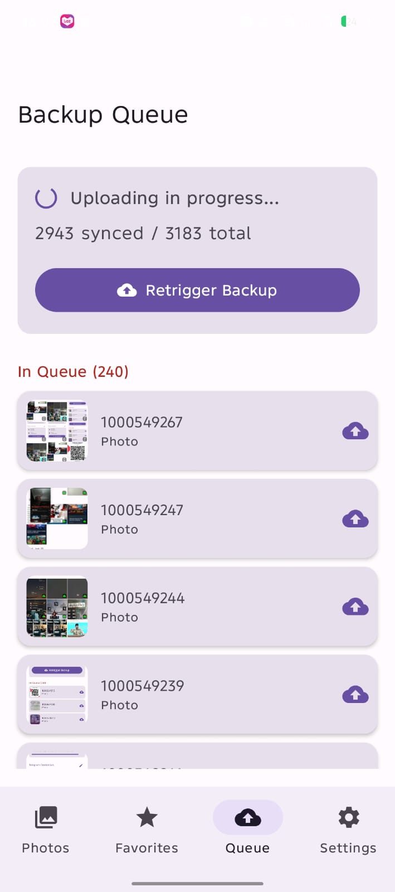
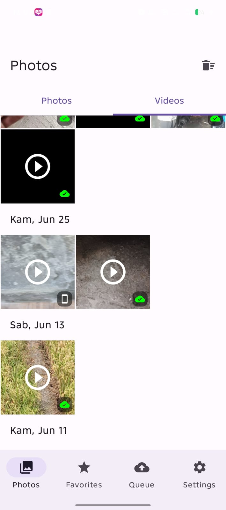
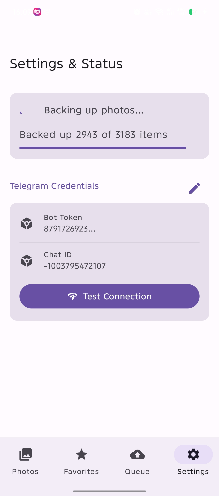
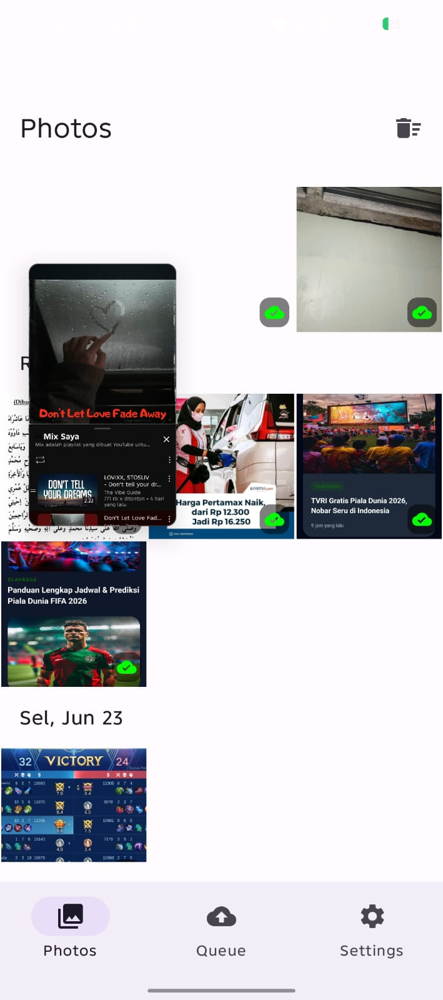
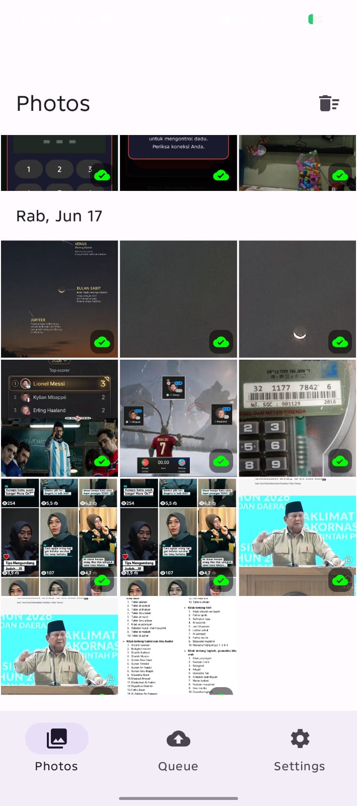
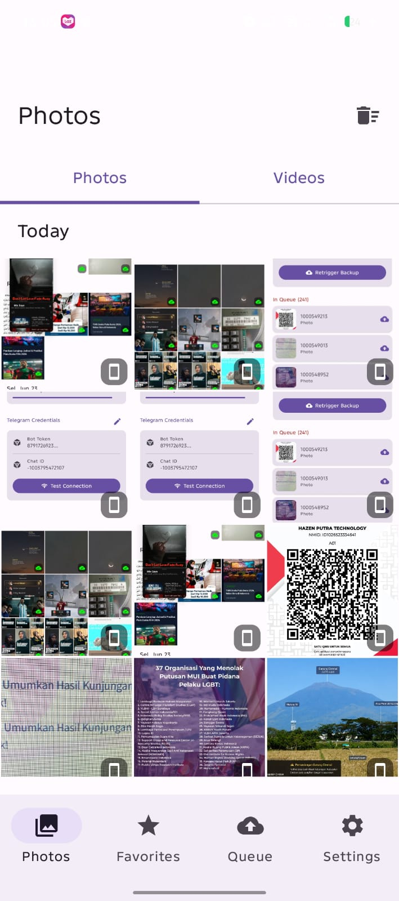
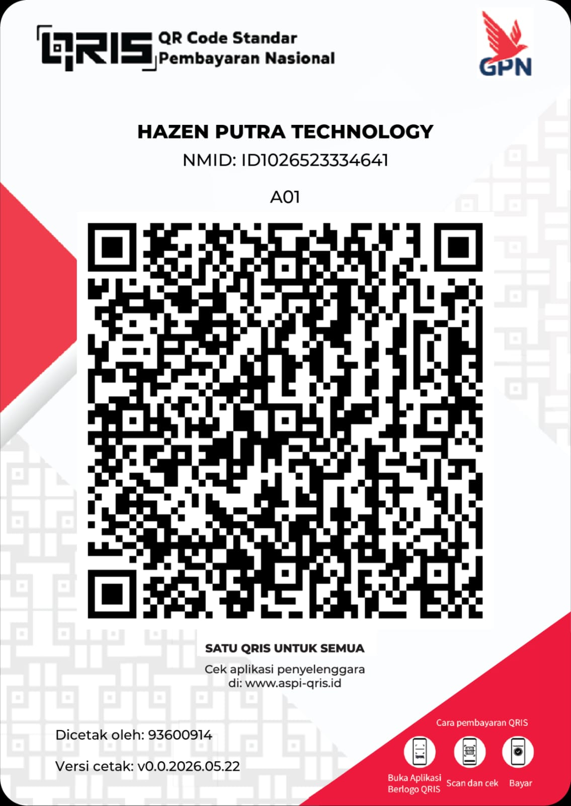

# TelePhotos

-green)
-blue)

[**📥 Download APK Terbaru (tes-app.apk)**](./tes-app.apk)

TelePhotos adalah aplikasi galeri cerdas berbasis Android yang menjadikan Telegram sebagai *cloud storage* (penyimpanan awan) tak terbatas. Aplikasi ini memungkinkan pengguna untuk membackup foto dan video ke Telegram secara otomatis, serta mengelola ruang penyimpanan lokal dengan aman. Uniknya, semua *state* dan metadata (seperti struktur Album) tidak menggunakan database eksternal, melainkan menggunakan file JSON yang diunggah dan di-*pin* langsung di Telegram.

## 🚀 Fitur Utama
Aplikasi ini memiliki 11 fitur wajib yang dirancang untuk kenyamanan dan keamanan pengguna:
1. **Kosongkan Ruang (Free Up Space):** Hapus file lokal dengan aman untuk menghemat memori HP, foto tetap tersimpan di Telegram (dilengkapi Modal Konfirmasi).
2. **Download/Restore:** Unduh kembali foto resolusi penuh dari Telegram ke memori lokal kapan saja.
3. **Auto-Backup:** Sinkronisasi latar belakang (menggunakan WorkManager) secara otomatis mengunggah foto baru ke Telegram.
4. **Sistem Album & Kategori:** Kelola album menggunakan integrasi data JSON *real-time* langsung di dalam channel Telegram.
5. **Favorit (Starred):** Tandai foto favorit untuk akses cepat.
6. **Tagging & Deskripsi:** Berikan tag dan deskripsi pada foto.
7. **Multi-Select Actions:** Mode seleksi massal (*long-press*) untuk menghapus, share, atau mengorganisasi banyak foto sekaligus.
8. **Pinch-to-Zoom Grid:** Sesuaikan ukuran grid galeri dengan mudah (cubit layar untuk mengubah tampilan 2 hingga 6 kolom foto).
9. **Detail Info (EXIF):** Lihat detail resolusi, ukuran (lokal vs telegram), tanggal, dan status sinkronisasi foto.
10. **Share Multiple:** Bagikan foto-foto secara massal ke aplikasi lain (didukung oleh sistem *caching* transparan di latar belakang untuk foto *Cloud-Only*).
11. **Dukungan Video & ExoPlayer:** Galeri secara otomatis memisahkan Foto dan Video ke dalam *Tab* yang rapi. Tonton video secara langsung di dalam layar detail (menggunakan pemutar bawaan *ExoPlayer*) tanpa harus pindah ke aplikasi lain!

## 🛠️ Panduan Developer (Cara Menjalankan)

### Prasyarat
- Android Studio Ladybug atau versi terbaru.
- JDK 17 atau di atasnya.
- Akun Telegram dan Bot Token (Buat melalui BotFather di Telegram untuk menghubungkan aplikasi ke channel).

### Langkah-langkah Compile & Build
1. Clone repositori ini dan masuk ke direktori proyek.
2. Buka proyek ini di **Android Studio**.
3. Tunggu hingga proses sinkronisasi Gradle selesai.
4. Anda dapat menjalankan aplikasi menggunakan emulator atau *device* fisik secara langsung melalui Android Studio (Klik tombol *Run*).

Atau, jika Anda ingin mem-build APK secara manual melalui Terminal (Windows/PowerShell):
```powershell
.\gradlew assembleDebug
```
APK hasil build akan di-generate di dalam folder: `app\build\outputs\apk\debug\app-debug.apk`. 

*Catatan: Kami juga telah menyediakan file kompilasi akhir bernama `tes-app.apk` langsung di root folder proyek ini untuk pengujian cepat.*

## 📸 Screenshots
<div style="display: flex; flex-direction: row; gap: 10px; overflow-x: auto;">
  
  
  
  
  
  
</div>

## ☕ Dukung Pengembangan (Donasi)
Jika Anda merasa aplikasi atau *source code* ini bermanfaat, Anda dapat mendukung pengembangan lebih lanjut dengan memberikan donasi melalui scan kode QRIS di bawah ini:



Terima kasih atas dukungannya!
